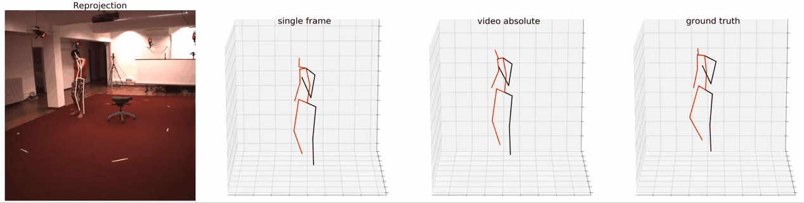

# 3d-human-pose
This is the work during my internship at [Horizon Robotics](https://en.horizon.ai/). 
The project is about 3d human pose estimation. We mainly focus on two parts. One is that we want to do it in a weakly supervised manner, more specifically, to learn a discriminator to distinguish valid poses. Another is that using temporal information to deal with jittering problem in generated 3d pose videos. 
There are some demos in folder [images](images).

## discriminator as weak supervision
For this part, we follow the work of [RepNet: Weakly Supervised Training of an Adversarial Reprojection Network
for 3D Human Pose Estimation](https://arxiv.org/abs/1902.09868).  
Folder [*repnet*](repnet) is the implementation of this paper. A global normalization step is applied which is different from the origin paper. We find the weight of reprojection loss needs to be increased as the training epoch goes.  
The result Mean Per-Join Position Error(MPJPE) is **76.5mm**(no alignment) and **54.3mm**(after procruste).

## temporal convolution in videos
For this part, we follow the work in [3D human pose estimation in video with temporal convolutions and
semi-supervised training](https://arxiv.org/abs/1811.11742).  
Folder [*video_gan_absolute*](video_gan_absolute) is the implementation. The difference is that we use gan as weak supervision. We decouple root joint position and relative pose. Add these two, we can get keypoints position in camera coordinates. The camera intrinsic parameters is given.  
The result is **70.5mm**(no alignment) and **51.2mm**(after procruste).

## 2d pose estimation
We use the framework of [simple baseline from Xiao Bin, etc](https://github.com/microsoft/human-pose-estimation.pytorch) to do 2d pose estimation. We load a pretrained model in MPII given by them.  
The code is in folder [*pose_resnet*](pose_resnet). We first use the ground truth bounding box to crop, and resize it to fixed size 384x384.

## conclusion
Although we do not achieve SOTA, we still can get some conclusions. First, the discriminator is powerful enough to replace fully supervised 3d labels. More 3d models can be used to train a more representative discriminator. Second, temporal convolution is benifical to alleviating jittering between frames, and the wrong pose, which is mainly from the self-occlusion in 2d image, can be corrected to some extend. 

Self-occlusion is an annoying problem. From my perspective, it can be solved when we are equipped with temporal information. Dario used 127 frames which is very long to deal with it. Another way may be the use of RNN.

We also think about build an end-to-end model from 2d estimator to 3d regressor,which may give better 2d results because of the 3d constraints. Because, 3d pose results rely heavily on the accuracy of 2d poses in our framework. Better 2d poses will definitely give rise to better 3d results.
